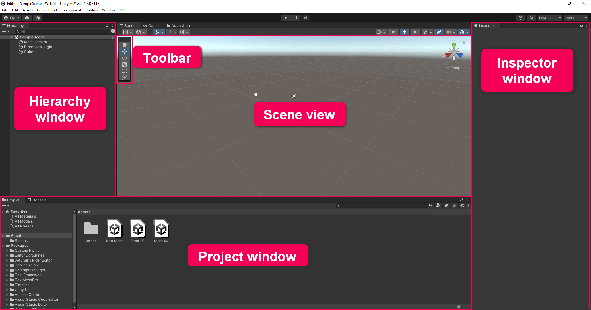
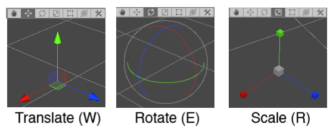
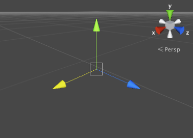
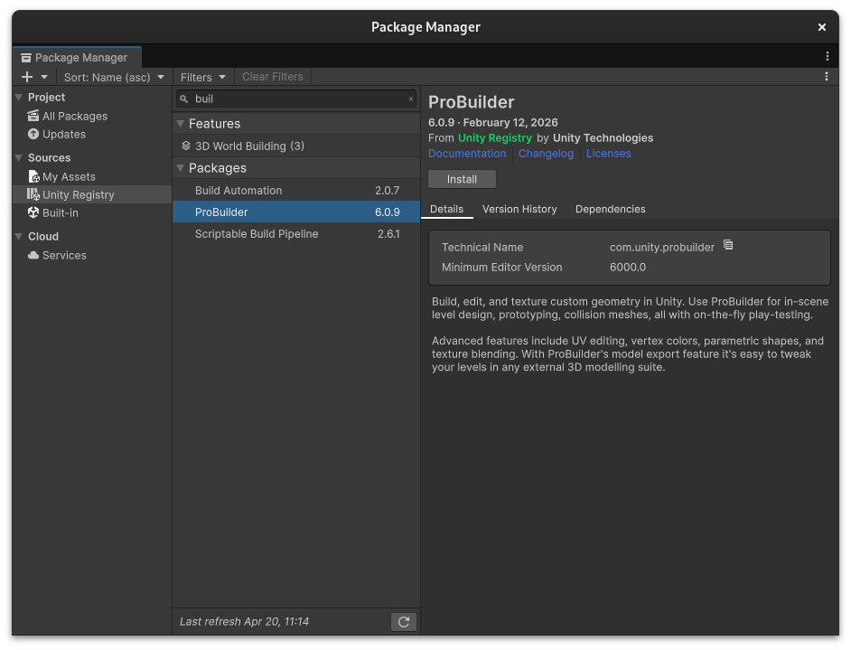
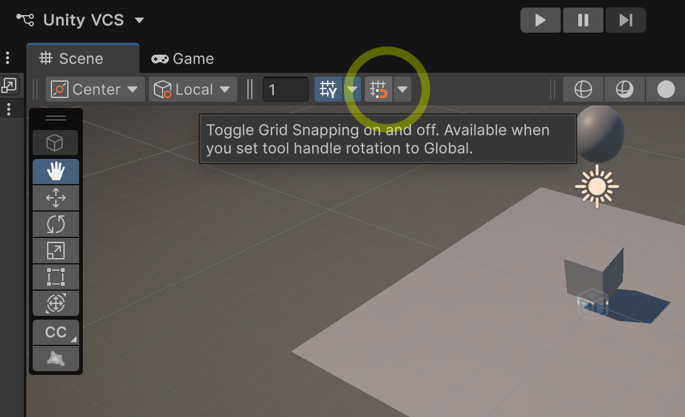
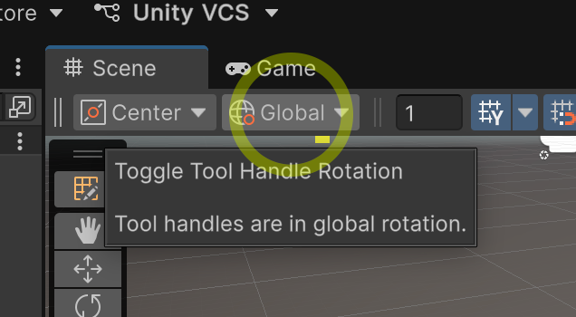
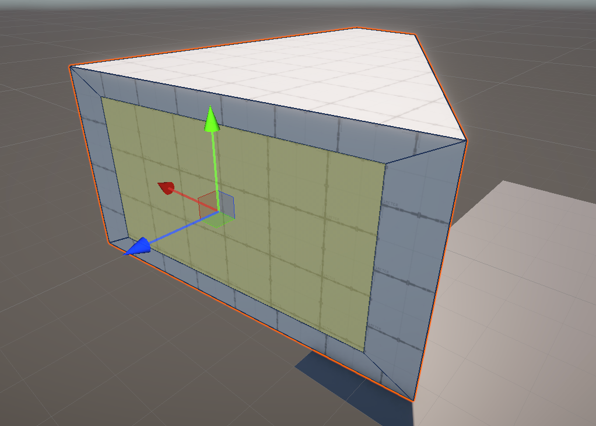
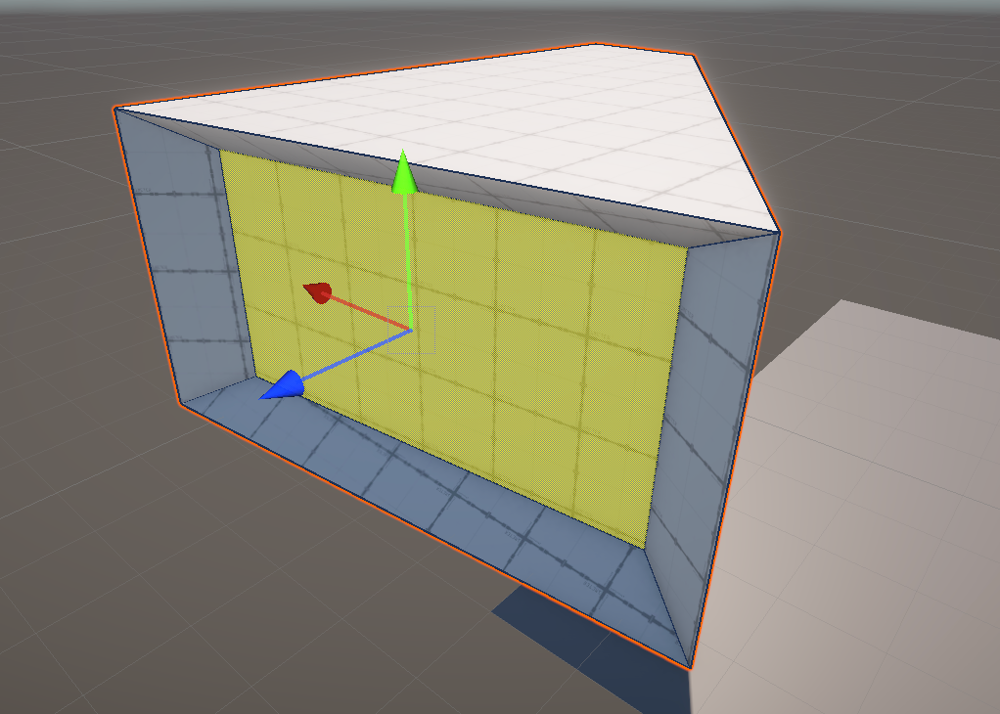
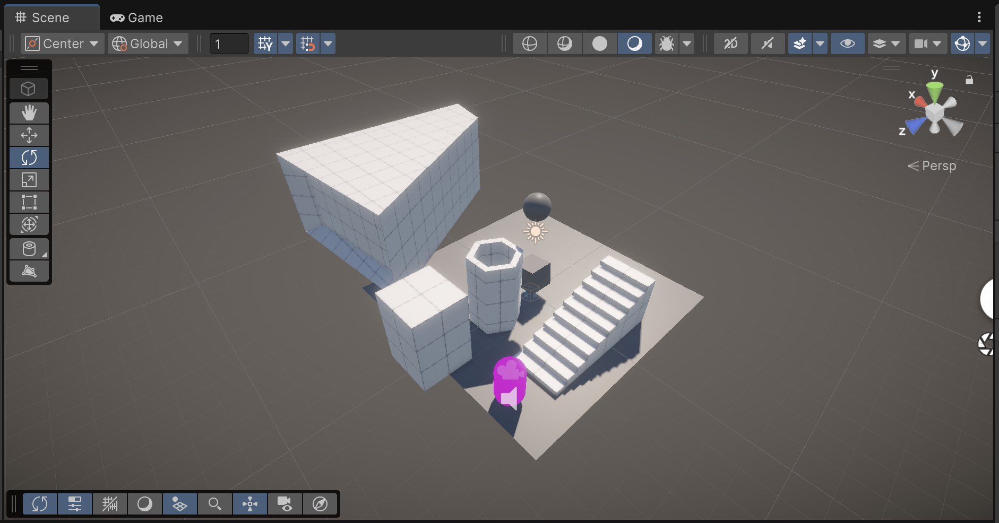

# Day 01: Foundations & Spatial Sketching

**Session Time:** 2.5 Hours

Welcome to your first steps in Unity. Today, we're moving from a blank slate to a walkable 3D gallery. We'll focus on the interface, basic physics, and building custom architecture.

##  Download Class Files

Before we begin, download the class files we'll be using throughout the workshop:

**[ Download Class Files (.zip)](https://github.com/new-media-edu/unity-trust/archive/refs/heads/main.zip)**

> [!NOTE]
> These files may be updated between sessions. If you're told to re-download, simply grab the latest `.zip` from the link above and replace your old copy - you can safely delete the previous download.

## Foundation: Project Setup

When you first open the Unity Hub, click **New Project** and select the **Universal 3D** template. This uses the **Universal Render Pipeline (URP)**, which is the industry standard for performance and high-quality visual effects.

Unity's interface can look complex, but you only need five main windows to build your world: **Hierarchy**, **Project**, **Scene**, **Game**, and **Inspector**.

## Creating Your First Objects

Right-click in the **Hierarchy** and select **3D Object > Plane** to create a floor. Then do the same to add a **Cube** (**3D Object > Cube**).

### Precision Placement
Select the Cube and look at the **Inspector** tab on the right to see its **X, Y, and Z** coordinates. To ensure it's perfectly centered, click the three vertical dots next to the **Transform** component and select **Reset**. This snaps it to (0, 0, 0).

### Setting the View
Press the **Play** button at the top. You might notice the camera is looking at nothing. To fix this:
1.  Stop Play mode.
2.  In the **Scene view**, fly to a position where you like the view of your objects.
3.  Select the **Main Camera** in the Hierarchy.
4.  Press **Shift + Cmd + F** (Mac) or **Shift + Ctrl + F** (Windows) to **Align with View**.

## Navigating the 3D World

### How to Move Around in Unity
Right-click in the **Scene view** and use **WASD** to fly around like a video game. 

### How to Manipulate Objects
To manipulate objects, keep these shortcuts in mind:
*   **W** - Move
*   **E** – Rotate
*   **R** – Scale
*   **Y is Up** – Always remember the vertical axis is Y.

### Navigation Tips
*   **Option + Left-click drag** - Orbit around a focal point (great for inspecting objects)
*   **Middle-click drag** - Pan the view
*   **F** - Frame/snap the view to whatever object is selected
*   **Double-click** an object in the Hierarchy to jump straight to it
*   **Scroll wheel** or **two-finger scroll** (trackpad) - Zoom in/out
*   **Cmd + D** - Duplicate selected object
*   **Cmd + Z / Cmd + Shift + Z** - Undo/redo (works on almost everything, including moving objects)

> **Note:** Flythrough mode (right-click + WASD) is the only way to get free movement in the Scene view. If you're on a trackpad and finding it difficult, plug in a mouse.

> **Deep Dive:** [Explore the Unity Editor](https://learn.unity.com/tutorial/explore-the-unity-editor-1?version=2021.3)

## Physics in Action

### Gravity & Physics Materials
Add a **Sphere** and position it directly above your Cube. With the sphere selected, click **Add Component** in the Inspector and search for **Rigidbody**. To make it more interesting, select your Cube and use the **Rotate tool (E)** to tilt it slightly. Hit **Play** and watch the sphere react to gravity!

*Tip: Try creating a **Physics Material** (Right-click in Project view > Create > Physics Material) to add bounciness or adjust friction, then apply it to your Sphere's Collider!*

## Architectural Sketching with ProBuilder

We’ll install **ProBuilder** together via `Window > Package Manager` (Search the Unity Registry). This tool allows you to build walls, stairs, and pedestals directly inside Unity.

### Setup for Precision
Before building, look at the top of the Scene view:
1.  **Enable Grid Snapping** (the magnet icon) so your walls line up perfectly.
2.  **Set Tool Handle Rotation to Global** (using the drop-down menu) to move objects easily along the main axes.
3.  **Set Active Context:** You must select the **ProBuilder Active Context** (the cube with nodes icon, usually found on the top left or top middle of the Scene View) in order to access ProBuilder's Vertex, Edge, and Face selection modes. *(Note: no image provided for this yet).*

### Building Your Room
1.  Open the **ProBuilder Window** (`Tools > ProBuilder > ProBuilder Window`).
2.  Click **New Shape** and try a **Cube** (for floors), **Stairs**, or a **Pipe**. Pay attention to the **Shape Settings** window to adjust steps or thickness.
3.  Switch to **Face Selection** (orange icon in the ProBuilder toolbar or Scene view overlay).
4.  Select a face of your shape (e.g., the top of a floor cube).

### Creative Experimentation & ProBuilder Shortcuts
The real power of ProBuilder is that you can manipulate individual faces, edges, and vertices:
*   **Extrude (Move):** Select a face, hold **Shift**, and drag with the **Move tool (W)**. Instead of just stretching the face, this extrudes a *new* block out of the surface (perfect for drawing walls).
*   **Extrude (Rotate):** Select a face, hold **Shift**, and drag with the **Rotate tool (E)**. This twists and extrudes the geometry outward.
*   **Inset (Scale):** Select a face, hold **Shift**, and drag with the **Scale tool (R)**. This creates a new, smaller face inside the original one-perfect for making window frames.
*   **Delete Faces:** Select a face and press **Backspace / Delete** to cut a hole into your shape.
*   **Exit Edit Mode:** Press **ESC** to stop manipulating the current ProBuilder shape and return to object selection.

 

## Walking Through the Space

To experience your gallery as a visitor, we'll add a first-person controller. There's one included in the class files.

1.  **Import:** In your Project window, right-click and select **Import Package > Custom Package**, or simply drag the entire `Free Basic First Person Controller` folder from the downloaded class files (`_Workshop_Assets/Free Basic First Person Controller`) into your **Assets** folder.
2.  **Setup:** Navigate to the `Free Basic First Person Controller` folder in your Project window and drag the **Free Basic First Person Controller.prefab** into your scene.
3.  **Finalize:** **Delete the default Main Camera** in your Hierarchy, as the controller has its own camera.

Hit **Play**! You can now walk through your gallery using **WASD** and look around with your **Mouse**. If you need to stop or use your cursor, just hit **Escape** to get control of your mouse back.

Your scene might look something like this:

## Homework

Expand your working 3D environment. Try modeling a building in your neighborhood or a famous piece of architecture.

## Continued Learning

[Click here for some short video tutorials on ProBuilder](https://unity.com/features/probuilder)
