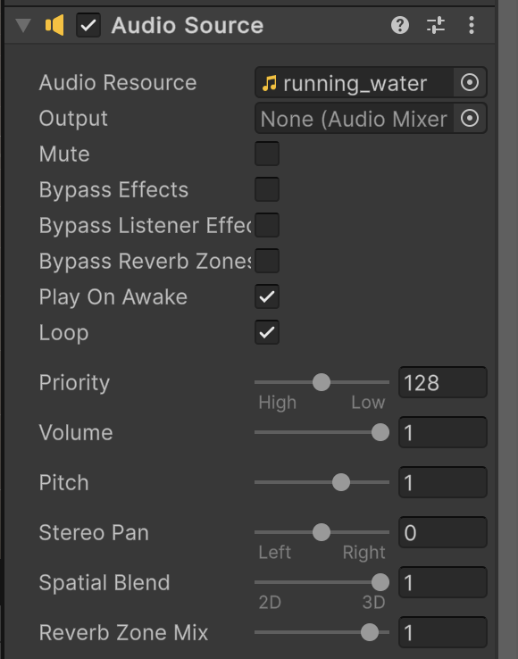
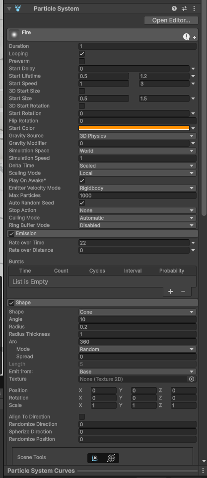
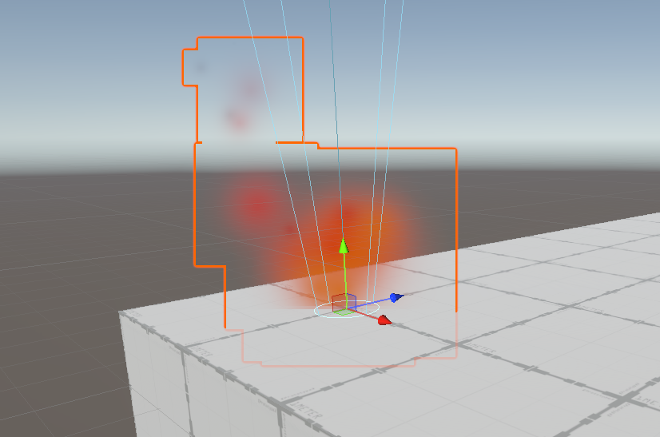
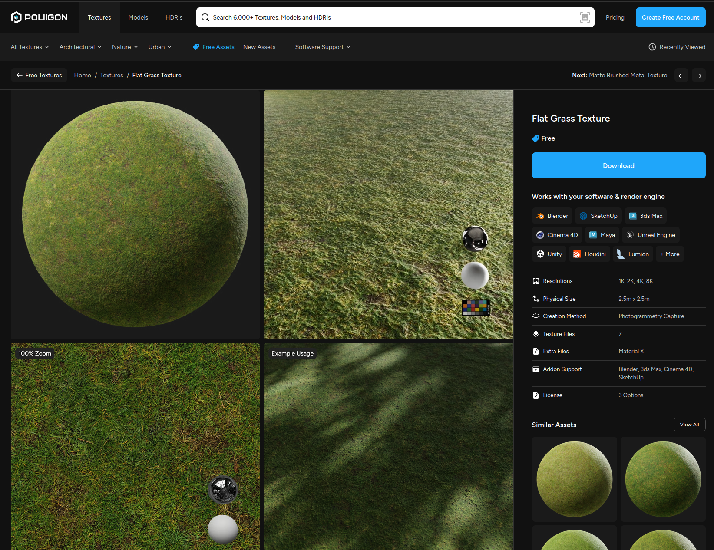
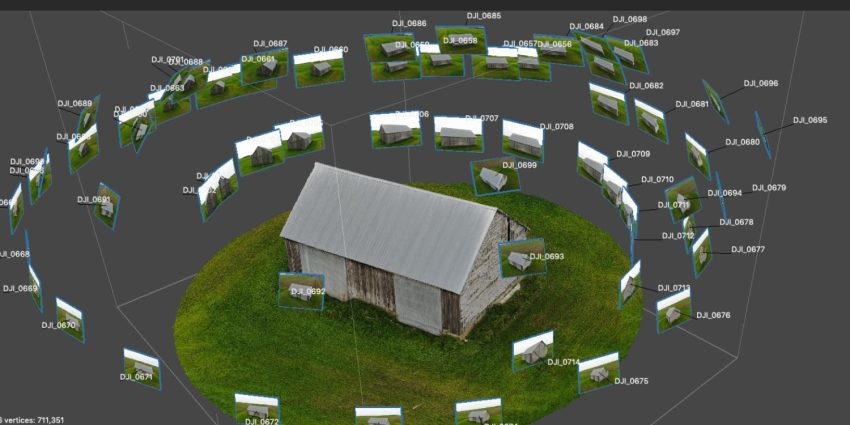
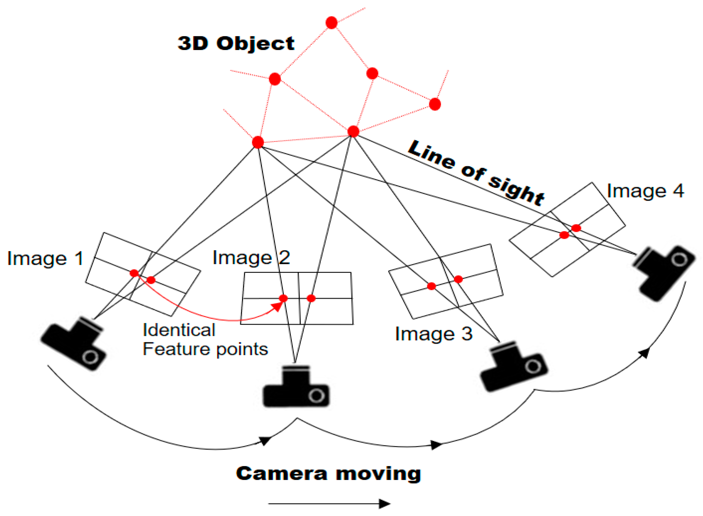

# Day 02: Building the World (Assets & Materials)

**Session Time:** 2.5 Hours

Today we transition from a "greybox" layout to a textured, populated world. We'll focus on importing high-quality assets, mastering materials, and using modular design to build efficiently.

> [!IMPORTANT]
> **Before starting today's session:**
> 1. **Install Polycam on your phone:** Download it from the [iOS App Store](https://apps.apple.com/us/app/polycam-3d-scanner-gltf/id1531533148) or [Google Play Store](https://play.google.com/store/apps/details?id=ai.polycam).
> 2. **Watch the tutorial:** Check out this [Polycam video tutorial](https://www.youtube.com/watch?v=BImnzs-rR_k) to see the photogrammetry capture process in action.

## Adding Sound

To bring your space to life, you'll need an **Audio Source**. 

1.  Right-click in the **Hierarchy** and select **Audio > Audio Source**.
2.  In the Inspector, drag a sound file (like `running_water.wav`) into the **AudioClip** slot.
3.  Set the **Spatial Blend** to **3D**. Now, the sound will grow louder as your character walks toward it.

 

## Making Fire (Particle Systems)

Unity's built-in **Shuriken** particle system can fake a convincing campfire in a few minutes. No shaders, scripts, or downloaded assets required.

### 1. Create the Particle System
1. Right-click in the **Hierarchy** and select **Effects > Particle System**.
2. Rename it `FireParticles` and move it where you want the fire to sit.

### 2. Main Module
Select `FireParticles` and set these top-level values in the Inspector. For any field with a small dropdown arrow, choose **Random Between Two Constants** to get the ranges below.

- **Duration:** `1.00`
- **Start Lifetime:** `0.5` to `1.2`
- **Start Speed:** `1` to `3`
- **Start Size:** `0.5` to `1.5`
- **Start Color:** bright orange or red
- **Simulation Space:** `World` (so flames trail naturally if the fire moves)

### 3. Turn Up the Emission
Open the **Emission** module and set **Rate over Time** to `20` or more. The default trickle of particles won't read as fire - you need a steady stream to fill out the flame.

### 4. Shape the Emitter
Open the **Shape** module:
- **Shape:** `Cone`
- **Angle:** `10` (keeps the flames in a narrow rising column)
- **Radius:** `0.2` (shrinks the base to a small campfire origin)

### 5. Fade and Shrink Over Lifetime
- **Color over Lifetime** - check the box, click the gradient, and pull the rightmost **alpha** stop down to `0` so particles fade out completely.
- **Size over Lifetime** - check the box, click the curve, and pick a preset that starts at `1.0` and drops to `0.0`.

### 6. Add Rising Heat
- **Force over Lifetime** - check the box and set **Y** to `2` (higher = more aggressive flames).

 

### If your particles look like pink squares
That magenta means the material isn't rendering. Open the **Renderer** module at the bottom of the component, click the circle next to **Material**, and pick a particle material. In this URP project the legacy `Default-Particle` shows up magenta, so make your own additive material instead - the [advanced fire guide](fire-particles-advanced.md) walks through it. Also confirm **Render Mode** is set to `Billboard`.

> **Want it to actually look hot?** A flat orange cone is a fine start. To push it into glowing, flickering, smoke-trailing fire, see **[Advanced Fire](fire-particles-advanced.md)**.

## Adding Images & Textures

Personalizing your gallery is as simple as dragging and dropping.

### Images on Walls
You can drag any image file from your **Project** window directly onto a geometric surface in the **Scene** view. Unity will automatically create a material for you.

Once you've applied an image, select the object and find its **Material** in the Inspector. Try these quick tweaks:

- **Metallic** slider - Drag right to make the surface look like metal.
- **Smoothness** slider - Higher = shiny/reflective, lower = matte/rough.
- **Base Map color** - Click the color swatch next to your texture to tint it.
- **Emission** - Check the box, pick a color, and your surface will glow.
- **Render Face** - Change from *Front* to *Both* if your surface is see-through from one side.

### Tiling & Textures
Textures are tiled by default. If your image looks too small or repetitive:
1.  Select the object.
2.  Find the **Material** in the Inspector.
3.  Adjust the **Tiling** values (X and Y) to scale the pattern.

**Bonus: Realism with Normal Maps**
To make your textures react to light and look 3D, look into **Normal Maps**. You can generate a normal map from any image using [NormalMap-Online](https://cpetry.github.io/NormalMap-Online/) and plug it into the **Normal Map** slot of your material in Unity.

For high-quality, seamless patterns (like wood, brick, or concrete), check out [Architextures](https://architextures.org/textures). You can also find free public-domain materials on [ambientCG](https://ambientcg.com/) or explore free assets on [Poliigon](https://www.poliigon.com/textures/free) (requires a free account). Alternatively, search for free materials directly in the [Unity Asset Store (make sure they are URP-compatible)](https://assetstore.unity.com/search#q=free%20materials%20urp).

## Mastering Materials & Shaders

Materials define how light reacts to a surface. In URP, we primarily use the **Lit** shader.

### The Anatomy of a Material
- **Base Map (Albedo):** The color or main texture of the object.
- **Normal Map:** Adds fake 3D detail (bumps, scratches) without adding geometry.
- **Metallic & Smoothness:** Controls how "shiny" or "rough" a surface looks.
- **Emission:** Makes parts of the object glow (useful for screens or neon).

### Transparency & Alpha
To create glass or fences, change the **Surface Type** from **Opaque** to **Transparent**. You can then adjust the **Alpha** channel of the Base Map color.

## Lighting Teaser

Unity starts you with a single **Directional Light** (the sun). Before we do a full lighting pass in Day 03, drop one of each main light type into your scene just to see what they do.

Right-click in the **Hierarchy** and choose **Light >**:

- **Directional Light** - your "sun." Lights the whole scene from one angle and controls global shadows. (You already have one - try rotating it to change the time of day.)
- **Point Light** - a bare bulb. Radiates in all directions from a single point; good for lamps, torches, or fireflies.
- **Spot Light** - a focused cone, like a flashlight or a gallery spotlight aimed at a piece.

For each one, drag it around and tweak **Color** and **Intensity** in the Inspector to see how it changes the mood.

> There's a fourth type, the **Area Light**, but it only shows up with baked lighting - we'll save it for Day 03.

We'll go much deeper on lighting - warm/cool color, shadows, fog, baking, and full cinematic lighting - in **[Day 03](../day03/README.md)**.

## Asset Integration: Beyond Basic Cubes

Unity supports various 3D formats, but **FBX** and **GLB/GLTF** are the most common.

### The Unity Asset Store
The [Asset Store](https://assetstore.unity.com/) is a massive library of free and paid assets.
1. Search for "Low Poly" or "Free" assets.
2. Click **Add to My Assets**.
3. In Unity, go to `Window > Package Manager`, select **My Assets**, and click **Download** then **Import**.

## Modular Design & Prefabs

Building a large environment piece-by-piece is slow. Instead, we use **Prefabs**.

### Creating a Prefab
1. Build an object in your scene (e.g., a lamp with a light source and a stand).
2. Drag the object from the **Hierarchy** into the **Project** folder.
3. It turns blue-this is now a Prefab!
4. You can now drag as many copies as you want into the scene. If you edit the Prefab file, **every copy** in the scene updates automatically.

### Modular Workflows
Use snapping (the magnet icon) to line up modular walls or floors perfectly. This is how professional game levels are built.

## Environmental Detail

### Foliage & Terrain
For natural environments, you can use Unity's **Terrain** system or simple mesh-based trees.
- Search for "Starter Assets" or "SpeedTree" samples in the Asset Store.

### Particle Effects (Simple)
Add a "mood" to your scene with basic particles.
1. Right-click > **Effects > Particle System**.
2. Try making a simple "dust" or "fog" effect by slowing down the speed and increasing the size of the particles.

## Photogrammetry

Photogrammetry is the process of using photos to create 3D models. We use **Polycam** to capture real-world objects. If you haven't yet, install the app on your phone (see the instructions and tutorial link at the top of this guide) and start thinking about objects or spaces you'd like to scan. We'll import these scans into Unity in Session 3.

### Installation
Install the Unity glTFast package using the Unity Package Manager.

To install the Unity glTFast package, follow these steps:
1. In your Unity project, go to **Window > Package Manager**.
2. In the dropdown in the top-left of the Package Manager window, select **Packages: Unity Registry**.
3. Search for **glTFast** (or **Unity glTFast**), select it, and click **Install**.
4. *Alternative:* Click the **Add (+)** button, select **Add package by name...**, enter `com.unity.cloud.gltfast`, and click **Add**.

> [!WARNING]
> Do **not** use **Add package from git URL...** with the glTFast GitHub URL. Doing so installs the absolute latest development branch, which contains APIs (like `ReadOnlySpan` overloads) that are incompatible with older Unity Editors. This will result in compiler errors like `cannot convert from 'System.ReadOnlySpan<byte>' to 'byte[]'`. If you did this, remove the Git version and reinstall from the Unity Registry.

### Optional Packages
There are some related packages that improve Unity glTFast by extending its feature set:
- **Draco™ 3D Data Compression Unity Package** (provides support for `KHR_draco_mesh_compression`)
- **KTX™ for Unity** (provides support for `KHR_texture_basisu`)
- **meshoptimizer decompression for Unity** (provides support for `EXT_meshopt_compression`)

> [!TIP]
> **Troubleshooting: `TypeLoadException` Errors**
> If you see `TypeLoadException: Could not load type 'GLTFast.AnimationMethod' from assembly 'glTFast'` in your console, it indicates conflicting versions of the package or stale cached assemblies. To resolve it:
> 1. **Check for duplicate packages:** In the Package Manager, make sure you don't have both the old `com.atteneder.gltfast` (or `org.gltfast`) and the new `com.unity.cloud.gltfast` installed. If you imported an older version manually, search your project's **Assets** folder and delete any stray `glTFast` folders or DLLs.
> 2. **Clear the cache:** Close Unity, delete the **`Library`** folder in your project's root directory (where `Assets` and `Packages` folders live), and reopen Unity. This forces Unity to cleanly rebuild all assembly cache references from scratch.

## Homework

1. **Polycam Scan:** Use Polycam to scan an object. It can be small or large, but make sure to follow the instructions and know that you might have to scan 2 or 3 things until one works out.
2. **Environment:** Create an environment that has both an indoor and an outdoor element. It's up to you to get as creative or practical with that as you choose. Integrate a photogrammetry scanned object into your scene.

Next session: Atmosphere and **Cinematics**.
