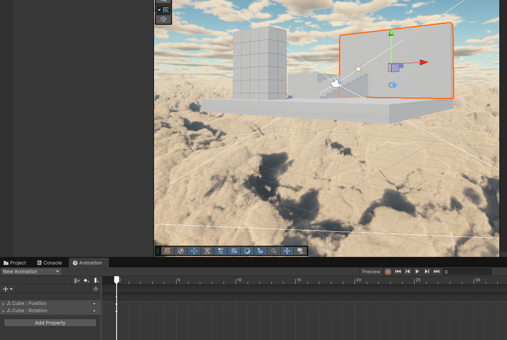
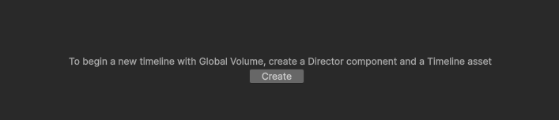
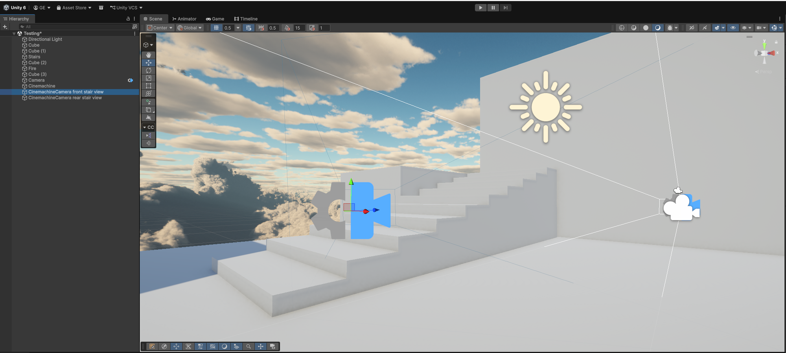
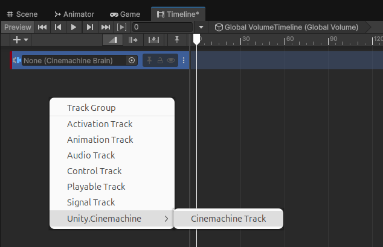
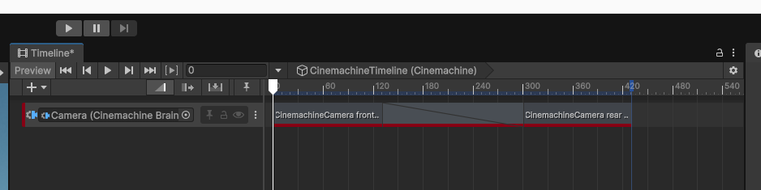

# Day 03: Atmosphere & Cinematic Storytelling

**Session Time:** 2.5 Hours

Today we transform your environment into a living, breathing world through advanced lighting and cinematic presentation.

## Bringing the Real World In: Importing Scans

If you created photogrammetry scans with Polycam, now is the time to bring them in.
- Export from Polycam as `.glb` or `.obj`.
- Drag the file into your **Project** window.
- **Scaling:** Scans often come in at the wrong size. Use the **Scale Factor** in the Import Settings or the Scale tool (R) to fix it.

## Lighting Design

Lighting is the most powerful tool for setting a mood. Last session we experimented with the different light types, now we'll use them more intentionally.

### Light Types in URP
- **Directional Light:** Your "Sun." Controls time of day and global shadows.
- **Point Light:** A bulb that radiates in all directions.
- **Spotlight:** A focused beam (perfect for gallery highlights).
- **Area Light:** Soft, window-like lighting (requires "Baking").

### Simple Tips for Better Lighting
A few small moves make a scene look intentional instead of flat:

- **Warm vs. cool.** Give lights a color instead of pure white. Warm oranges (interiors, fire, sunset) against cool blues (shadows, sky, moonlight) instantly add depth. Set the **Color** on each light in the Inspector.
- **Turn down the sun.** A Directional Light at full **Intensity** blows everything out. Dropping it to `0.5`-`1.0` and letting smaller point/spot lights do the accent work reads far more cinematic.
- **Adjust the Environment (ambient) light.** Open **Window > Rendering > Lighting**. The **Environment** tab controls the flat "fill" light in shadows. A dim, colored ambient keeps shadows from turning pure black.
- **Skybox as a light source.** Your skybox actually lights the scene. Swapping to a sunset or overcast sky in the Lighting window changes the whole mood for free.
- **Soft shadows.** On a light, set **Shadow Type** to **Soft Shadows**. Hard shadows look like a video game; soft edges look grounded.
- **Fewer, stronger lights.** Resist scattering dozens of dim lights. One or two strong key lights plus a soft fill almost always beats a room full of weak ones - and it runs faster.
- **Fog for atmosphere.** In the Lighting window's **Environment** tab, enable **Fog**. A subtle color-matched fog adds depth and hides where your geometry ends.

> **Bloom makes lights glow.** To get that soft glow around bright lights and emissive surfaces, add a **Global Volume** (`GameObject > Volume > Global Volume`), add a **Bloom** override, and check **Post Processing** on your Camera. See the [advanced fire guide](../day02/fire-particles-advanced.md#6-bloom-makes-it-glow) for the full steps.

### Going Further
Want richer, higher-quality lighting - baked global illumination, light cookies, real lights attached to particles (like a flickering campfire that lights the room), reflections, and how the **Volume** system actually fits in? See the **[Advanced Lighting guide](lighting-advanced.md)**.

## Advanced Atmosphere

### Fog & Atmosphere
In **URP** (the pipeline this workshop uses), fog is not a Volume override - it lives in the Lighting window.
1. Open `Window > Rendering > Lighting` and go to the **Environment** tab.
2. Scroll down and enable **Fog**.
3. Set the **Mode** (Linear or Exponential), pick a **Color** that matches your skybox, and tune the density/distance until the far edges of your scene fade softly into the haze.

Color-matched fog is one of the fastest ways to add depth and hide where your geometry ends.

> **Note:** True *volumetric* fog with visible light beams (god rays) is an **HDRP** feature, not URP. If you want those, that's a reason to explore HDRP later - but the Environment-tab fog above covers most gallery moods.

### Atmospheric Effects & Post-Processing
Your scene automatically includes a **Global Volume**. Think of this as a cinematic filter for your camera. Select it in the Hierarchy, find the **Vignette** effect in the Inspector, and try increasing the **Intensity**. This darkens the edges of the screen for a focused, gallery-like feel.

## Mood & Reflection

### Skyboxes
The Skybox provides the background and the "ambient" light.
- Go to `Window > Rendering > Lighting`.
- In the **Environment** tab, you can swap the **Skybox Material**.
- Pro Tip: Search for "HDRIs" to get realistic 360-degree backgrounds.

**Download some skyboxes and try them.** A great free starting set is [AllSky Free - 10 Sky / Skybox Set](https://assetstore.unity.com/packages/2d/textures-materials/sky/allsky-free-10-sky-skybox-set-146014) on the Asset Store.
1. Open the link, click **Add to My Assets**, then **Open in Unity**.
2. In Unity's **Package Manager** (`Window > Package Manager`), find **AllSky Free** under **My Assets** and click **Download**, then **Import**.
3. Open `Window > Rendering > Lighting`, go to the **Environment** tab, and click the small circle next to **Skybox Material** to pick one of the imported skies.
4. Cycle through a few - a sunset, an overcast day, a night sky - and watch how the whole mood (and the ambient light) changes for free.

### Light Baking & Emissive Materials
Baking (pre-calculating) your lighting allows you to create realistic, soft bounced light and shadows (including glowing light from emissive materials) without impact on runtime performance.

1. **Create an Emissive Material:**
   - Select your material in the Project window.
   - In the Inspector, check the **Emission** box.
   - Choose a color/intensity (tint) or drag in your emissive texture.
   - Ensure the **Global Illumination** dropdown on the material is set to **Baked**.
2. **Mark Objects as Static:**
   - Select any non-moving geometry (walls, floors, props, or glowing neon lights) in the Hierarchy.
   - In the top-right of the Inspector, check the **Static** box (this flags the object to contribute to Global Illumination).
3. **Generate the Lighting:**
   - Go to **Window > Rendering > Lighting**.
   - Click the **Generate Lighting** button at the bottom-right corner. Unity will calculate and bake the lightmaps in the background.

### Reflection & Light Probes
- **Reflection Probes:** Capture the surroundings to make metallic objects look realistic.
- **Light Probes:** Allow moving objects (like your player) to receive light from "baked" sources.

## Basic Animation

Before we move the *camera*, let's move *objects*. Unity's **Animation** window lets you keyframe almost anything - position, rotation, scale, colors, light intensity - to make a door swing, a sculpture spin, or a platform rise.

1. Open the Animation window: **Window > Animation > Animation** (or press `Ctrl/Cmd + 6`). Dock it along the bottom next to your Project tab.
2. In the **Hierarchy**, click the object you want to animate (say, a **Cube**).
3. With the object selected, the Animation window shows a **Create** button. Click it and save the new **Animation Clip** (`.anim`) into your project. This also adds an **Animator** component to the object - that's what plays the clip.
4. Click **Add Property** and choose what you want to animate. For a moving object, add **Transform > Position** and **Transform > Rotation** (each has a **+** to add it). They now appear as rows on the left.

5. Now keyframe the motion:
   - Make sure **record mode** is on - the round **red button** at the top-left of the Animation window is lit.
   - Leave the playhead (the white line) at **0**, this is your starting pose.
   - Scrub the playhead **forward** along the Animation ruler to a later time (drag the white line, or type a number in the frame field).
   - **Move or rotate the object** in the Scene view to where you want it at that moment, then press **K** to drop a **keyframe** (a diamond appears on the row). In record mode, moving the object often keyframes it automatically too, but `K` is the reliable way to force one.
   - Repeat: scrub forward, reposition, press **K**. Unity fills in the in-between motion for you (this is called *tweening*).
   - Press the **▶** in the Animation window to preview. Turn **off** the red record button when you're done so you don't keyframe by accident.

### How time works here
The ruler across the top is your timeline, and the **Samples** rate (top-left, default **60**) is how many frames make up one second.
- So a keyframe at frame **60** happens **1 second** in; frame **120** is 2 seconds, and so on. Click the time readout to toggle the ruler between **frames** and **seconds:frames**.
- **Speed = spacing.** The farther apart two keyframes sit, the slower the motion between them. Want it faster? drag the keyframes closer together. Slower? spread them out. (Lowering **Samples** stretches everything out; raising it packs it in.)
- **Looping:** clips loop by default. To make it play once, select the `.anim` file in the Project window and uncheck **Loop Time** in the Inspector.

You can drop these animated objects straight into your scene, or trigger/sequence them later from Timeline.

## Cinematics with Timeline & Cinemachine

We’ll use **Cinemachine** together with **Timeline** to create a cinematic "flythrough" of your space.

**What Cinemachine does:** instead of hand-animating a single camera, you place a bunch of lightweight **Cinemachine Cameras** around your scene - each one is just a *shot*, a saved viewpoint (position, angle, zoom). None of them render on their own; a single real camera (the one with the **Cinemachine Brain**) follows whichever Cinemachine Camera is currently "live." **Timeline** is where you decide the order and timing of those shots, and Cinemachine automatically **animates the camera between them** - so overlapping two shots gives you a smooth flythrough with no keyframing. Cinemachine can do a lot more (cameras that follow or orbit a target, handheld shake, collision avoidance), but shot-to-shot blending is all we need here.

(These steps are for **Unity 6** with **Cinemachine 3**, which is what installs from the Package Manager today.)

### Setup
1. Install **Cinemachine** from the Package Manager (`Window > Package Manager > Unity Registry`, search "Cinemachine", **Install**).
2. Create an empty GameObject and rename it "Cutscene" (`GameObject > Create Empty`).
3. With "Cutscene" still selected, open the Timeline window (`Window > Sequencing > Timeline`).
4. The Timeline window shows a **Create** button. Click it, then save the Timeline asset somewhere in your project. This adds a **Playable Director** component to your Cutscene object and opens the empty timeline.

### Directing the Camera

First, give the flythrough its own camera so it doesn't fight your first-person player:
1. Select the **Camera** nested under your First Person Controller. In the Inspector, find the **Cinemachine Brain** component, click the **⋮** menu at its top-right, and choose **Remove Component**. (Your FPS movement doesn't need it - the controller moves that camera directly.)
2. Create a dedicated camera: `GameObject > Camera`, and rename it "Cutscene Camera".
3. With **Cutscene Camera** selected, click **Add Component** in the Inspector and add a **Cinemachine Brain**. This camera is now the one Cinemachine drives.

Now build the shots. **One Cinemachine Camera = one camera angle. All of them go on a single Cinemachine Track.**

4. Create one **Cinemachine Camera** per shot: `GameObject > Cinemachine > Cinemachine Camera`. Rename each so you can tell them apart ("front stair view", "rear stair view", ...) and move/rotate each in the Scene view to frame that shot. The blue camera gizmo shows what it sees.

5. In the Timeline, click **+ > Unity.Cinemachine > Cinemachine Track**. **Do this exactly once** - a single track holds every shot.

6. Bind the track. On the left edge of the track is a field reading **`None (Cinemachine Brain)`**. Click the target icon on its right and pick your **Cutscene Camera** (the one with the Brain). It should now read **`Cutscene Camera (Cinemachine Brain)`**.
7. Add your shots **onto that same track**: drag each Cinemachine Camera from the Hierarchy and drop it **directly on the Cinemachine Track**, one after another. Each drop becomes a shot clip aimed at that camera.
   - ⚠️ Drop them **on the track row itself**, not in the empty grey area below it. Dropping into empty space creates a **second track**, and two Cinemachine tracks fight over the same camera (this is why nothing plays right). You want **all clips on one track**.
8. Line the clips up left-to-right, with the first one starting at frame **0**. To blend from one shot to the next, drag a clip so its edge **overlaps** the neighbor - the crossed/hatched overlap is the blend, and Cinemachine smoothly flies the camera between the two angles there.

9. **Preview it:** press the **▶ play button inside the Timeline window** (top-left, next to "Preview") and watch the **Game** tab - that's where the flythrough renders, not the Scene tab. To make it play when you press the main editor Play button instead, select your timeline object and check **Play On Awake** on its **Playable Director** component.

> **Which camera shows up?** With two cameras in the scene, Unity renders the one with the higher **Depth** (on the Camera component). While building your flythrough, set the **Cutscene Camera** to a higher Depth (e.g. `1` vs the player's `0`), or just uncheck the player camera, so the Game view shows the cutscene. For a playable intro that hands control back to the player, disable the First Person Controller while the timeline plays and re-enable it at the end (an **Activation Track** in the Timeline can do this without code).

## Scripted Interactivity (No Coding Required)

The class files include a set of scripts in `_Workshop_Assets/Scripts/` to add life to your scene.

- **AutoRotate.cs:** Make objects (like art pieces) spin.
- **SimpleTrigger.cs:** Trigger an event (like a light turning on) when the player walks into a zone.
- **AudioCrossfader.cs:** Smoothly switch between music tracks as you enter different rooms.
- **LookAtPlayer.cs:** Make an object (like an eye or a spotlight) always face the visitor.

**How to use:** Drag the script onto an object in the Hierarchy and look at the Inspector to adjust the settings.

## Homework: Atmosphere & Pacing

Prepare your project for the final showcase.
1. **Refine Lighting & Sound:** Dial in your mood. Use fog for visual density and ambient wind/audio to ground the space.
2. **Interactivity:** Add at least two scripted elements (e.g., a rotating sculpture or a triggered event) to make the space feel alive.
3. **Cinematic Cutscene:** Refine your 30-second Timeline flythrough. Focus on smooth camera transitions and interesting angles.

Next session: **Post-Processing, Builds, and Showcase.**
