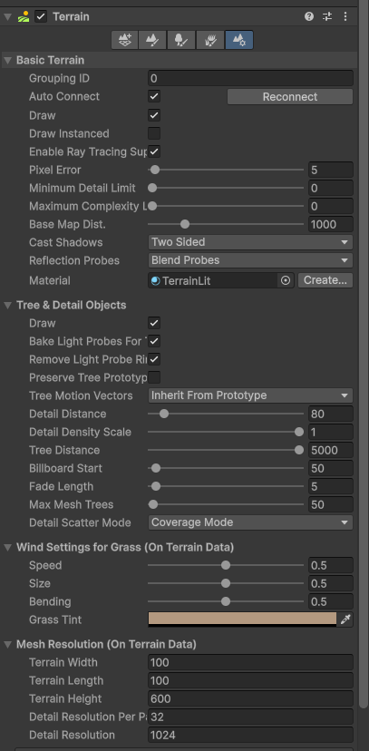
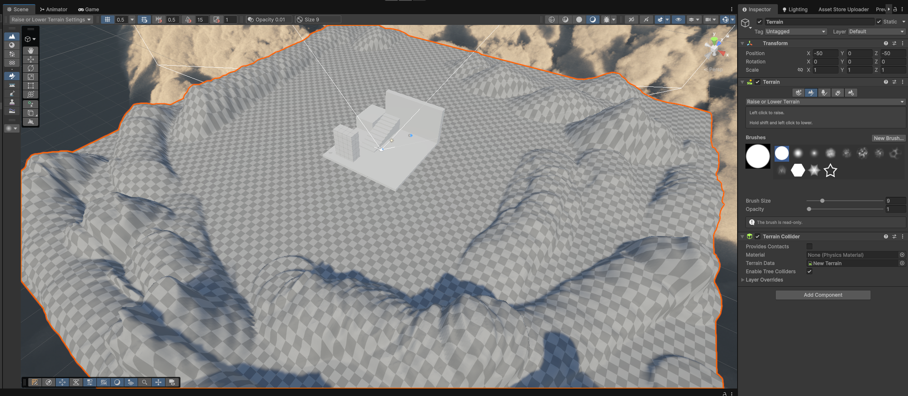
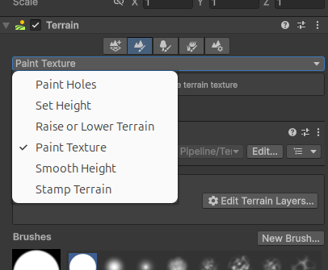

# Terrain: Sculpting the Ground

Part of **[Day 4](README.md)**.

So far our floors have been flat ProBuilder surfaces. Unity's **Terrain** system lets us sculpt organic ground: hills, valleys, riverbeds, dunes.

## Creating the Terrain

1. Go to `GameObject > 3D Object > Terrain`.
2. A new Terrain appears in the Hierarchy. It is **enormous** by default, and it is going to dwarf everything you've built. That's expected, we fix it next.

## Resizing It

There is no popup asking how big you want it, so we resize it after the fact.

1. Select the **Terrain** in the Hierarchy.
2. In the Inspector, the Terrain component has a row of five icons. Click the **far right icon** (Terrain Settings).
3. Scroll down to **Mesh Resolution** and set:
   - **Terrain Width:** `100`
   - **Terrain Length:** `100`
   - **Terrain Height:** `50`

> [!IMPORTANT]
> Do this **before** you sculpt anything. Changing the width or length rescales any hills you've already made, and it stretches them out of shape.

**Why change the height?** Terrain Height defaults to `600`, which is the vertical range the sculpting brush works across. At 600, a single click launches a mountain into the sky and sculpting feels broken. At `50` the brush becomes gentle and controllable.

## Centering It

A Terrain's position is its **corner**, not its middle. So a fresh terrain sits entirely off to one side of your scene.

In the **Transform**, set the Position to:
- **X:** `-50`
- **Y:** `0`
- **Z:** `-50`

That's half the width and half the length, which pulls the terrain back so it's centered on the world origin.

## Sculpting

1. Back in the Terrain component, click the **second icon** (Paint Terrain).
2. Make sure the dropdown below it says **Raise or Lower Terrain**.
3. Pick a **Brush** shape from the grid. The soft, fuzzy ones give you smoother, more natural hills than the hard-edged ones.
4. Set **Brush Size** and **Opacity**.
   - **Brush Size** is how wide your brush is. Around `9` is good for detail, go much bigger for broad landscape shapes.
   - **Opacity** is how fast it builds. Start **low**, around `0.01` to `0.1`. High opacity makes spikes, not landscapes.
5. **Left click and drag** in the Scene view to raise the ground. **Hold Shift** and drag to lower it.

> [!TIP]
> A brand new terrain sits at height zero, so you can only sculpt **upward**. To carve down into it (a valley, a pond, a crater) first raise the whole thing: choose **Set Height** from the dropdown, set Height to something like `5`, and click **Flatten**. Now you have room to go both directions.

## The Other Sculpting Tools

That dropdown has more than just Raise or Lower. Click it and you'll see:

| Mode | What it does |
|---|---|
| **Raise or Lower Terrain** | Your main brush. Click to raise, Shift+click to lower. |
| **Smooth Height** | Softens what you've already sculpted. Brush over lumpy, spiky areas to relax them. |
| **Set Height** | Type an exact height and **Flatten** the whole terrain to it, or brush that height in. |
| **Stamp Terrain** | Stamps the brush shape in as a hill of a set height. Good for quick repeated mounds. |
| **Paint Texture** | Paints ground surfaces. We'll use this next. |
| **Paint Holes** | Cuts holes clean through the terrain, for cave mouths and openings. |

> [!TIP]
> **Smooth Height** is the fix for "my terrain looks like crumpled tinfoil." Sculpt roughly and fast, then smooth it back. That's much easier than trying to be delicate on the first pass.

## Giving It a Surface

Your terrain is currently a grey checkerboard. That is not a bug and it is not a broken material, it just means the terrain has no **Terrain Layer** yet. A Terrain Layer is the texture that gets painted onto the ground.

**First, get a ground texture.** The class files include four, ready to go. Drag the whole `_Workshop_Assets/Terrain_Textures/` folder into your Unity **Project** window.

| Texture | Good for |
|---|---|
| `grass_004` | A base layer. Lush green lawn grass. |
| `sparse_grass` | A base layer. Dry grass over soil, browner and more muted. |
| `roots` | Forest floor, undergrowth, anything overgrown. |
| `rocky_trail_02` | Paths and worn routes. Paint it where people would walk. |
| `cracked_red_ground` | Dry, arid, desert. Also good for a dried-out riverbed. |

Each one has a `_diff` file (the colour) and a `_nor_gl` file (the surface relief). We'll use both.

**Want more?** [Poly Haven](https://polyhaven.com/textures) and [ambientCG](https://ambientcg.com/) both have thousands of ground textures, free under the CC0 public domain licence, no account needed. Download at **1K or 2K**; the 4K and 8K options will slow your laptop down for no visible benefit at terrain scale.

**Then build the layer:**

1. In the Terrain component, click the **second icon** (Paint Terrain) again.
2. Change the dropdown to **Paint Texture**.
3. Under **Terrain Layers**, click **Edit Terrain Layers... > Create Layer**.
4. A texture picker opens. Choose a colour map, the file ending in **`_diff`**. `sparse_grass_diff_1k` is a good base.
5. The checkerboard disappears. The **first** layer you add automatically covers the entire terrain.

## Tiling and Normal Maps

Two adjustments turn a flat-looking texture into convincing ground. Select your layer in the Terrain Layers list to find these.

**Tiling.** Set **Tiling Settings > Size** to around `5` and `5`. Too small and the ground reads as a fine busy pattern rather than a surface; too large and it turns to blurry mush. Nudge it until it looks like ground and not like wallpaper.

**The Normal Map.** This is the payoff from our materials session. Drag the matching **`_nor_gl`** file into the layer's **Normal Map** slot. Suddenly the ground catches light and has real surface relief instead of looking painted on. It is the single biggest quality jump available here for one drag.

> [!NOTE]
> `nor_gl` means "normal map, OpenGL format," which is the flavour Unity expects. If you download textures elsewhere and see a choice between **GL** and **DX**, always take **GL**. The DX version inverts the lighting so bumps read as dents, which looks subtly and unfixably wrong.

**Adding a second surface.** Repeat steps 3 and 4 to create another layer. Unlike the first one, this one does **not** flood the terrain. Select it, then paint it on by hand where you want it.

Try `rocky_trail_02` for this. Painting a worn path into the low ground and along the routes people would actually walk, and leaving grass everywhere else, is the fastest way to make a landscape look deliberate rather than generated. Lower the brush **Opacity** and the two surfaces blend into each other instead of meeting at a hard edge.

## Making the Terrain Look Good

A sculpted, textured terrain still tends to look like a video game level from 2004. These are the fixes, in order of how much they buy you per minute spent.

> [!TIP]
> If you only do two things, do the first two. They take about a minute combined and they change everything.

### 1. Lower the sun

Select your **Directional Light** and set its Rotation **X** to somewhere around `20` to `35`.

Light coming from directly overhead flattens a landscape completely; every slope receives the same amount of light, so all your sculpting work becomes invisible. Low, raking light throws long shadows down the sides of your hills and suddenly the shape of the land reads. This is the single biggest difference between terrain that looks flat and terrain that looks like somewhere.

It also makes the light warmer and more directional, which is most of what people mean when they say a shot looks cinematic.

### 2. Turn on fog

1. Open `Window > Rendering > Lighting`.
2. Go to the **Environment** tab.
3. Scroll to **Other Settings** and check **Fog**.
4. Set **Mode** to `Exponential Squared` and **Density** to something small, around `0.01`.
5. Set the fog **Color** by eyedropping a colour from your sky near the horizon.

Fog does two jobs at once. It adds aerial depth, so distant hills read as distant instead of as flat cutouts. And it **hides the edge of your terrain**, which is otherwise the thing that most obviously breaks the illusion, since your world visibly stops and drops into nothing.

> [!NOTE]
> This is regular distance fog, not volumetric fog. URP doesn't have volumetric fog built in, so don't expect visible shafts of light.

### 3. Nothing in nature is flat

Large flat areas are the strongest tell that a terrain was made in a hurry. Real ground undulates everywhere, even where it looks level.

Go back to **Raise or Lower Terrain**, set a **very large Brush Size** and a **very low Opacity** (`0.01`), and make a few slow passes over your flat areas. You want variation you can barely see. Then run **Smooth Height** over the result.

### 4. Check your tiling

If your ground reads as a flat sheet of single-colour paint rather than as a surface, the texture is tiling too few times. Select the layer and lower **Tiling Settings > Size** until actual detail appears.

The reverse is also true: if it looks like busy visual noise, raise the Size. You are looking for the point where you can tell what the material is but you can't see the repeat.

### 5. Soften the boundaries between layers

Where two painted surfaces meet at a visible edge, it reads as paint. Select your second layer, drop the brush **Opacity** right down, and work back and forth over the boundary so the two surfaces interleave over a wide, uneven band instead of meeting at a line.

While you're there: paint your rock layer onto the **steep** faces and let grass keep the flatter ground. That is how real landscapes work, because loose soil and plants can't hold onto a steep slope.

### 6. Sit your building into the ground

A structure resting on dead-flat terrain looks dropped in. Give it a foundation instead:

1. Choose **Set Height** from the dropdown.
2. Set a **Height** matching the ground level you want.
3. Use a small brush to **flatten a deliberate terrace** for the building to sit on.
4. Paint `rocky_trail_02` as a path leading up to the entrance.

A flat pad plus a worn path is a small amount of work that makes the architecture and the landscape look like they belong to each other.

### 7. Smooth your ridgelines

If your hills look like long rounded worms (the shape a Raise brush naturally makes when you drag it), run **Smooth Height** along the tops with a medium brush. Real ridges are uneven: high in places, collapsed in others. Smoothing selectively, rather than everywhere, is what breaks up the uniformity.

### 8. Sharpen the silhouette

In **Terrain Settings** (the far right icon), lower **Pixel Error** from `5` to `1`.

This makes Unity draw the terrain closer to the shape you actually sculpted, at some performance cost. Worth doing before you record video, and worth turning back up if your frame rate suffers while you work.

## Trees and Grass (Optional)

Unity 6 doesn't come with any plants, so if you want to add trees and grass you'll need to download some. [Quaternius Stylized Nature MegaKit](https://quaternius.com/packs/stylizednaturemegakit.html) is free, public domain, and has 40 trees plus plants, rocks and bushes. Unzip it, drag the folder into your Project window, and drag a tree into your scene.

Two notes if you try it:

- If the trees come in bright magenta, select their materials and run `Edit > Rendering > Materials > Convert Selected Built-in Materials to URP`.
- To plant them across the terrain quickly, use the **third icon** (Paint Trees) and `Edit Trees... > Add Tree`. Make sure you actually drag a tree into the **Tree Prefab** slot, because an empty slot means painting silently does nothing.

## Troubleshooting

**"My terrain is cutting through my building."**

Sculpt around it, or lower the terrain's **Y** position so the ground sits below your existing floor and only pokes up where you want it to.
